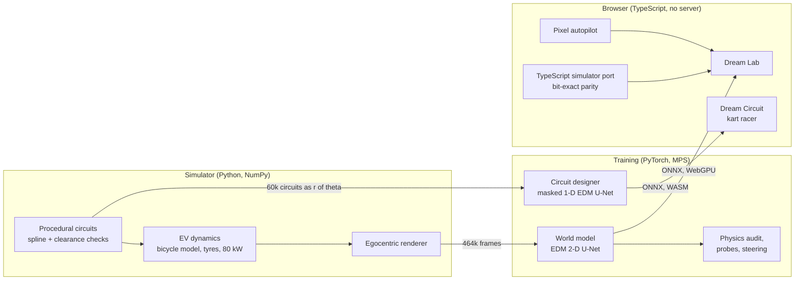

<h1 align="center">Dream Circuit</h1>

<p align="center"><b>A retro kart racer whose tracks are dreamed, live, by a diffusion model.</b><br>
During lap 1 a neural network builds the circuit a few hundred meters ahead of the race leader, one arc at a time.<br>
When the loop closes it locks, and laps 2 and 3 are raced on the track it dreamed.</p>

<p align="center">
  <a href="https://nilayd2007.github.io/dreamcircuit/"><b>Play it in your browser</b></a> ·
  <a href="https://nilayd2007.github.io/dreamcircuit/data.html">The data</a> ·
  <a href="#the-circuit-designer">How the tracks are dreamed</a> ·
  <a href="#the-dream-lab-a-world-model-you-can-drive">The Dream Lab</a> ·
  <a href="docs/DESIGN.md">Design notes</a> ·
  <a href="docs/MODEL_CARD.md">Model cards</a>
</p>

<p align="center"></p>
<p align="center"><sub>A real race, captured from the game: the start, a row of item boxes, a Turbo in the item slot. The bar at the top fills as the circuit is dreamed. On the minimap, white is road that exists and violet is the designer's current guess at the rest of the lap.</sub></p>

<p align="center"><sub><!-- designer-stats:start -->
2.2M-parameter circuit designer · 99% of live-built circuits drivable · 4.5 MB, runs on the CPU in a browser tab · 24 Heun steps per arc
<!-- designer-stats:end --></sub></p>

---

## What this is

1. **The game.** A third-person, Mode-7-style kart racer in a 384x216 framebuffer: up to 7 AI rivals, three speed classes, three worlds, item boxes, drifting and mini-turbos, a full HUD, and chiptune sound synthesized on the fly. Keyboard, gamepad or touch. Everything runs in the browser with no server, and there are no image or sound files: the karts, scenery and sound are generated by code.
2. **The circuit designer.** A masked-conditional diffusion model (EDM, 1-D U-Net) trained on 57,000 procedural circuits. In the game it inpaints the road ahead of the karts, conditioned on everything already built, and closes the loop at the start line. **No circuit exists before the race starts.**
3. **The Dream Lab** (the DATA tab on the main menu). A second diffusion model, a *world model*, that imagines an entire racing simulator frame by frame from the keys you press, plus the science around it: a physics audit of the dream, linear probes that find a speedometer inside the network, and steering vectors that edit its physics live.

<p align="center"></p>
<p align="center"><sub>Dream Valley, Neon Night and Sunset Mesa. Same HUD, same live designer.</sub></p>

## The game

| | |
|---|---|
| **Grand Prix** | 3 laps on a circuit dreamed for that race; re-race your last locked circuit from the setup screen |
| **Rivals** | 0 to 7 AI karts with racing lines, braking points, overtaking room, drifts into tight corners, and the classic rubber band |
| **Difficulty** | Rookie, Pro and Legend: top speed, grip and how sharply the rivals drive |
| **Driving** | Arcade handling with surfaces (asphalt, kerb, shoulder, grass), drifts that charge blue and orange mini-turbos, kart-to-kart bumps |
| **Items** | Rows of item boxes on the dreamed road and a roulette slot. **Turbo** is a boost; **Oil Slick** drops behind you and spins out whoever drives through it; **Dream Orb** flies up the road and homes onto the kart ahead. The odds depend on position (the leader mostly gets oil, the back of the pack turbos and orbs), and the rivals use items too |
| **HUD** | Lap counter, race and best-lap timers, live position with podium colors, item slot with roulette, standings for the whole field, speed and boost bar, minimap with the designer's guess, start lights |
| **Rendering** | Mode-7 ground with mipmaps and distance fog, a parallax sky, billboarded scenery, karts voxel-baked into 16 viewing angles at load time, and a shimmering "dream mist" at the edge of the road that does not exist yet |

<p align="center"></p>

## The circuit designer

**The representation makes the problem an inpainting problem.** Every circuit winds once around its center, so it can be written as a radius function r(θ) sampled at 128 angles, with the start line at θ = 0. Any such signal is a closed loop by construction, and "the road built so far" is a contiguous arc of known samples. Building the rest of the lap is filling in the unknown samples, conditioned on the known ones.

**The model** is a 1-D U-Net with circular padding (the lap is periodic, so the road always meets itself), self-attention at the bottleneck, and EDM preconditioning (Karras et al., 2022). Its input channels are the noisy profile, a 0/1 mask of known angles, the known values, and sin/cos of the angle, so it knows where the start/finish straight is. Training shows it random known arcs, and none at all 20% of the time. One model therefore does everything the game needs: dream a whole circuit, extend the road, and close the loop with both ends fixed.

**Live, in the game:**

1. Before the countdown, it dreams the start grid and the first stretch (36 of 128 angles), in about 0.25 s on a laptop.
2. During lap 1, whenever the leader gets within 34 angles (about a quarter of a lap) of the end of the road, it dreams the next 16 angles, conditioned on everything already built. Each arc is 24 Heun steps (47 network calls), spread one call per animation frame so the game never stutters.
3. Each new arc is lightly smoothed and then checked in context against the generator's own rules: minimum corner radius, grass between stretches that pass close to each other, and lap length. A failing arc is resampled up to 3 times; if all of them fail, a more heavily smoothed version is kept so the race goes on. Road that exists never moves.
4. The last arc closes the gap to the grid. The circuit **locks**, the minimap turns solid, and laps 2 and 3 run on exactly the road that was dreamed.

<picture>
  <source media="(prefers-color-scheme: dark)" srcset="docs/assets/trackgen_growth_dark.png">
  
</picture>

**Does it consistently build proper tracks?** Measured with `dreamcircuit eval-tracks`. "Drivable" means the same constraints the procedural generator enforces, checked on the reconstructed centerline:

<!-- trackgen:start -->
| What was measured | Result |
|---|---|
| Whole circuits dreamed from nothing that pass every drivability check | **98.4%** of 1,000 (96.5% before arc smoothing; failures: 2 length, 14 too tight) |
| Circuits built live, arc by arc, the way lap 1 builds them | **99.0%** of 200 |
| Arcs resampled per live circuit (the game's retry rule) | 0.46 on average |
| Mean lap length of a dreamed circuit | 564 m (the game drives it at 1.5x scale) |
<!-- trackgen:end -->

<picture>
  <source media="(prefers-color-scheme: dark)" srcset="docs/assets/trackgen_gallery_dark.png">
  
</picture>

Getting there took two rounds. The first model, sampled with 12 steps, produced drivable circuits 92% of the time; most failures were single corners a little tighter than the generator's 9 m minimum radius. Doubling the sampler steps and adding a light Gaussian smoothing of each new arc (σ = 1 angle sample, applied to the new arc only) raised whole-circuit validity to 98.4%. The live procedure lands higher still, because a failing arc is resampled before it is ever committed. A longer training run from the same checkpoint scored *worse* partway through its learning-rate schedule and was stopped; the 8,000-step model ships.

## The Dream Lab: a world model you can drive

The DATA tab holds the project this game grew out of: **a racing simulator that does not exist.** Every frame is imagined by a diffusion model, live in the browser, from the last four frames and the keys you press.

<p align="center"></p>
<p align="center"><sub>One pixel-only autopilot, two worlds. Left: a physics simulator. Right: the neural network's dream, which the autopilot drives from the network's own imagined frames. No game code runs on the right.</sub></p>

<p align="center"><sub><!-- stats:start -->
9.7M parameters · 1.84 GMACs per denoising step · 10,000 training steps · 19.6 MB in the browser · 463,680 training frames from 360 circuits
<!-- stats:end --></sub></p>

1. **The world.** A physically grounded simulator of a Formula Student-class electric race car: dynamic bicycle model, Pacejka-style tyres with a friction ellipse, an 80 kW power cap, traction control and ABS, on procedurally generated circuits marked with Formula Student cones (blue left, yellow right). It is also where the circuit designer's training circuits come from.
2. **The dream.** An EDM diffusion U-Net (the DIAMOND / GameNGen recipe) trained from scratch on 464k frames to predict the next frame from the last four frames and the controls. Exported to ONNX and run at 15 fps on WebGPU.
3. **The audit.** The question video-model benchmarks keep asking (PhyWorldBench, WorldBench, PhysicalRealismBench), asked of a model that can be checked exactly: *does the dream obey physics?* An instrument built on differentiable image registration reads dreamed frames back into speed and yaw rate and compares them with the simulator.
4. **The mind.** Linear probes find quantities the network was never told about (yaw rate, slip, curvature of road it cannot see yet), and steering vectors edit the dream's physics live: push one direction and the world rushes by without the throttle being touched.

Everything below is measured on 40 circuits the model never saw during training. The numbers are generated from `results/summary.json` by `scripts/update_readme.py`; none are typed by hand.

<!-- results:start -->
| What was measured (held-out circuits) | Dream | Reference |
|---|---|---|
| Next-frame PSNR | **37.0 dB** | 24.3 dB copying the last frame |
| PSNR after 1 s / 4 s of dreaming | **23.2 / 17.6 dB** | 18.4 / 16.6 dB |
| Speed error vs. the real car, first second | **0.31 m/s** | speeds of 6-29 m/s |
| Dreamed speedometer vs. dreamed motion | **0.62 m/s** | 0.17 m/s instrument floor on real frames |
| Moments exceeding tyre grip (friction circle) | **2.6%** | 0.6% on real frames |
| Counterfactual steering turns the right way | **100%** | yaw-rate correlation 0.99, response ratio 1.01 |
| Throttle vs. brake changes speed the right way | **100%** | response ratio 0.90 |
<!-- results:end -->

<picture>
  <source media="(prefers-color-scheme: dark)" srcset="docs/assets/fidelity_dark.png">
  
</picture>

**The dream responds to controls it was never explicitly taught.** From one set of starting frames, five different control sequences produce five different futures:

<p align="center"></p>

<picture>
  <source media="(prefers-color-scheme: dark)" srcset="docs/assets/controllability_dark.png">
  
</picture>

### Inside the network

<!-- probes:start -->
| Linear probe on the bottleneck (held-out R²) | Trained | Raw pixels | Random weights |
|---|---|---|---|
| Yaw rate | **0.87** | 0.35 | 0.18 |
| Steering angle | **0.91** | 0.36 | 0.33 |
| Lateral slip | **0.49** | 0.00 | 0.00 |
| Curvature 10 m ahead | **0.85** | 0.69 | 0.31 |
| Curvature 30 m ahead (beyond view) | **0.46** | 0.20 | 0.01 |
| Heading vs. track | **0.35** | 0.00 | 0.01 |
<!-- probes:end -->

Speed is left out of that table on purpose: it is drawn in the frame's HUD, so even raw pixels decode it (R² ≈ 0.98). Yaw rate exists in no single frame, and the curvature 30 m ahead lies beyond the top edge of the view; the network represents both.

<picture>
  <source media="(prefers-color-scheme: dark)" srcset="docs/assets/probes_dark.png">
  
</picture>

**Decodable is not the same as used.** A ridge probe's direction can decode a quantity and still be ignored by the network: pushed along it, the dream barely changes. The difference-of-means ("mass-mean") direction, pushed equally hard, rewrites the dream's physics, mirroring what Marks & Tegmark found for truth directions in language models:

<!-- steering:start -->
Pushing the bottleneck along the mass-mean *speed* direction moves the dreamed speed from **2.8 m/s** (alpha = -2) to **24.7 m/s** (alpha = 2) with the controls held neutral. The ridge-probe direction, pushed equally hard, moves it from 13.4 to 14.5 m/s.
<!-- steering:end -->

<picture>
  <source media="(prefers-color-scheme: dark)" srcset="docs/assets/steering_dark.png">
  
</picture>

### The autopilot

A 0.66M-parameter CNN, distilled from a privileged expert that sees the true track geometry ("learning by cheating"), drives from four frames of pixels. Because it only ever sees pixels, it can drive inside the dream, which is what the animation at the top of this section shows.

<!-- policy:start -->
From pixels alone the autopilot laps held-out circuits at **2.03 laps/min** (96% of its privileged teacher's 2.11), off the asphalt 3.9% of the time. One round of DAgger cut that from 5.3%.
<!-- policy:end -->

## How it works



**One network call per frame.** The circuit designer runs on ONNX Runtime Web's WASM backend on the main thread. Between network calls the sampler waits for the next animation frame, so dreaming an arc costs each frame a few milliseconds instead of one long stall. The race code adds a safety net for slow devices: no kart can drive past road that has not been dreamed yet, because speed is capped by the distance left to the frontier. With a quarter-lap lookahead, it only matters on slow devices.

**The world model in the browser.** The denoiser is exported with its EDM preconditioning built in, so the page runs only a 4-line Euler loop around it. GroupNorm is rewritten as one fused InstanceNormalization per layer (on WebGPU, per-kernel dispatch overhead, not FLOPs, dominates small models). Weights are stored as fp16 and cast to fp32 in the graph: half the download, and it runs on every GPU.

**The audit instrument.** For an egocentric top-down camera, consecutive frames differ by a rigid motion of the car. A joint grid search over forward motion and rotation, refined by Adam through `grid_sample`, recovers that motion from pixels. On real frames it agrees with the simulator's ground truth to R² = 0.999 for both speed and yaw rate near the track. Run on dreamed frames, it measures the dream's physics.

## Engineering highlights

- **Found a bug in ONNX Runtime Web.** Its WebGPU convolution returns wrong results when the input-channel count is divisible by 3 but not by 4 (6, 9, 15 and 30 are wrong; 12 and 16 are right). Located with a per-node WebGPU-vs-WASM diff tool over 471 intermediate tensors (`web/tools/`), characterized with a channel sweep, and worked around by zero-padding the first convolution from 15 to 16 input channels, which is exact.
- **And a sharp edge in it.** The lab's two inference sessions share one WASM module, and a `run()` started while another was still in flight corrupted it (`RuntimeError: memory access out of bounds`), after which every run on the page failed. Switching lab modes mid-clip was enough to trigger it. Every inference now goes through one page-wide queue (`web/src/ort-queue.ts`, with tests).
- **Bit-exact cross-language simulator.** The TypeScript port of the physics and renderer reproduces Python's trajectories to machine precision (about 1e-15), and **0 of 258,048 pixel bytes differ**. To get there, the port emulates NumPy's float32 rounding and its summation order. CI checks it against golden trajectories on every push.
- **Game logic under test, headlessly.** Live track growth (committed road never moves, the loop closes and locks), lap counting (including backing over the line), the inference queue, items (odds, pickups, oil, homing orbs, and press-not-hold firing in a full 8-kart race), and AI rivals that must lap a twisty circuit off the grass and drift its corners. A crowded-race test caught kart bumps pumping speed in pile-ups: the impulse was not projected onto each kart's heading, and one kart reached 88 m/s. The race was also driven end to end in a browser through a dev-only hook.
- **90 tests** in all: 63 in pytest, including Hypothesis property tests that fuzz the vehicle dynamics, and 27 in Vitest. `ruff`, `mypy` and `tsc` are clean, and CI runs everything on GitHub Actions with CPU-only PyTorch.
- **Data at simulator speed.** 464k frames from 360 circuits in 100 s on 10 cores, written straight into shared memmaps. The designer's 60k circuits take 3 minutes.
- **Reproducible end to end.** `make all` regenerates every model, number and chart in this README; the numbers are written in by `scripts/update_readme.py`. (The gameplay captures come from the game itself.)

## Quickstart

Requires Python 3.11+, [uv](https://github.com/astral-sh/uv) and Node 22+. Training used an Apple M4 Pro (MPS); CUDA and CPU work too.

```bash
make setup      # venv + dependencies + web app
make tracks     # circuit designer: 60k circuits, training, validity at scale, figures (~30 min)
make data       # world model data: 464k training frames, 39k test frames (~2 min on 10 cores)
make train      # the world model (~3.5 h on an M4 Pro, resumable)
make policy     # the pixel autopilot (~15 min)
make export     # ONNX models + simulator assets for the browser
make report     # physics audit, probes, steering, figures, web summary, README numbers
make web-dev    # http://localhost:5173 (the game); the Dream Lab is at /data.html
```

`make test` runs both test suites. `make lint` runs ruff, mypy and tsc.

## Repository map

```
src/dreamcircuit/
  trackgen/   circuit designer: polar circuits, masked 1-D EDM model, live generation, eval, figures
  sim/        track generation, vehicle dynamics, renderer, vectorized env, scripted drivers
  data/       parallel dataset generation, memmapped window sampling
  model/      world-model U-Net, EDM wrapper + sampler, pixel policy
  train/      world model and autopilot training loops
  eval/       registration instrument, physics audit, probes + steering, report
  export/     ONNX export with WebGPU-safe transforms, web assets + parity fixtures
web/
  index.html  the game          src/game/   renderer, race, AI, HUD, menus, live circuit designer
  data.html   the Dream Lab     src/        world-model engine, simulator port, lab UI, charts
tests/        pytest suites (physics invariants, models, instruments, data, circuit designer)
configs/      training configurations (TOML)
results/      evaluation output that the README and website render
docs/         design notes, model cards, figures
```

## Honest limitations

- **Circuits are star-shaped.** The polar representation cannot express a track that doubles back past its own center angle, so there are no figure-eights or crossovers, and no elevation. That is what makes "closed loop" free and inpainting natural; it is the right trade for a kart racer, not for every circuit.
- **"Drivable" is geometric.** Validity means the generator's constraints hold: corner radius, clearance, length. It says nothing about whether a circuit is *fun*, and the designer has never seen a race.
- **The game's handling is arcade.** Karts use simple arcade physics tuned for feel. The EV simulator with tyres and a power cap lives in the Dream Lab, where the physics matters.
- **The world model is small.** It sees a 64x64 top-down view of a simple scene. The method scales; this compute budget does not. It has no long-term memory either: turn around and it re-imagines the road behind you.
- **The physics audit compares against a simulator, not a real car.** It tests whether the network learned *these* laws of motion, which is exactly what makes it checkable.

## References

- Karras et al., *Elucidating the Design Space of Diffusion-Based Generative Models* (EDM), NeurIPS 2022.
- Lugmayr et al., *RePaint: Inpainting using Denoising Diffusion Probabilistic Models*, CVPR 2022.
- Alonso et al., *Diffusion for World Modeling: Visual Details Matter in Atari* (DIAMOND), NeurIPS 2024.
- Valevski et al., *Diffusion Models Are Real-Time Game Engines* (GameNGen), 2024.
- Ha & Schmidhuber, *World Models*, 2018.
- Chen et al., *Learning by Cheating*, CoRL 2019; Ross et al., *DAgger*, AISTATS 2011.
- Li et al., *Emergent World Representations* (Othello-GPT), ICLR 2023; Marks & Tegmark, *The Geometry of Truth*, 2023.
- *What Do World Models Learn in RL? Probing IRIS and DIAMOND*, 2026.
- Pacejka, *Tire and Vehicle Dynamics*; Rajamani, *Vehicle Dynamics and Control*.

## License

MIT. See [LICENSE](LICENSE). The game's pixel font is Press Start 2P by CodeMan38, under the SIL Open Font License 1.1 (via `@fontsource/press-start-2p`). All other art and sound are generated by the code in this repository.
