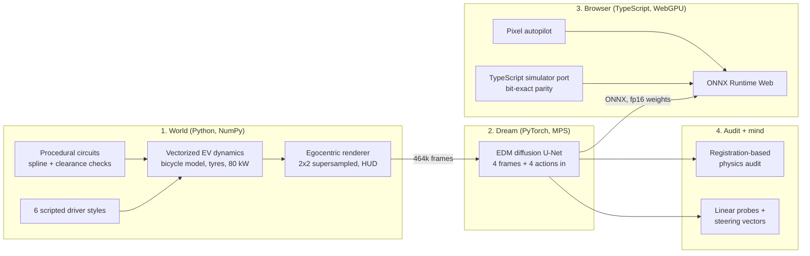

<h1 align="center">DreamCircuit</h1>

<p align="center"><b>A racing game that does not exist.</b><br>
Every frame is imagined by a diffusion model, live in your browser, from the last four frames and the keys you press.<br>
Then an audit checks whether the dream obeys the laws of physics, and a probe finds a speedometer inside the network.</p>

<p align="center">
  <a href="https://nilayd2007.github.io/dreamcircuit/"><b>Play it in your browser</b></a> ·
  <a href="#how-it-works">How it works</a> ·
  <a href="#results">Results</a> ·
  <a href="docs/DESIGN.md">Design notes</a> ·
  <a href="docs/MODEL_CARD.md">Model card</a>
</p>

<p align="center"></p>
<p align="center"><sub>One pixel-only autopilot, two worlds. Left: the physics simulator. Right: the neural network's dream, which the autopilot is driving from the network's own imagined frames. No game code runs on the right.</sub></p>

<p align="center"><sub><!-- stats:start -->
9.7M parameters · 1.84 GMACs per denoising step · 10,000 training steps · 19.6 MB in the browser · 463,680 training frames from 360 circuits
<!-- stats:end --></sub></p>

---

## What this is

World models, neural networks that *are* the game engine, are the frontier of 2025-26 (Genie 3, GameNGen, DIAMOND, Oasis, Matrix-Game). DreamCircuit builds one end to end, small enough to understand completely and to run in a browser tab:

1. **The world.** A physically grounded simulator of a Formula Student-class electric race car: dynamic bicycle model, Pacejka-style tyres with a friction ellipse, an 80 kW power cap, traction control and ABS, on procedurally generated circuits marked with Formula Student cones (blue left, yellow right).
2. **The dream.** An EDM diffusion U-Net (the DIAMOND / GameNGen recipe) trained from scratch on 464k frames to predict the next frame from the last four frames and the controls. Exported to ONNX and run at 15 fps on WebGPU, in your browser, with no server.
3. **The audit.** The question that video-model benchmarks keep asking (PhyWorldBench, WorldBench, PhysicalRealismBench) asked of a model we can check exactly: *does the dream obey physics?* An instrument built on differentiable image registration reads dreamed frames back into speed and yaw rate and compares them with the simulator.
4. **The mind.** Linear probes find quantities the network was never told (yaw rate, slip, curvature of road it cannot see yet), and steering vectors let you edit the dream's physics live: push one direction and the world rushes by without the throttle being touched.

## Results

Everything below is measured on 40 circuits the model never saw during training. The numbers are generated from `results/summary.json` by `scripts/update_readme.py`; none are typed by hand.

<!-- results:start -->
| What was measured (held-out circuits) | Dream | Reference |
|---|---|---|
| Next-frame PSNR | **37.0 dB** | 24.3 dB copying the last frame |
| PSNR after 1 s / 4 s of dreaming | **23.2 / 17.6 dB** | 18.4 / 16.6 dB |
| Speed error vs. the real car, first second | **0.31 m/s** | speeds of 6-29 m/s |
| Dreamed speedometer vs. dreamed motion | **0.62 m/s** | 0.17 m/s instrument floor on real frames |
| Moments exceeding tyre grip (friction circle) | **2.6%** | 0.6% on real frames |
| Counterfactual steering turns the right way | **100%** | yaw-rate correlation 0.99, response ratio 1.01 |
| Throttle vs. brake changes speed the right way | **100%** | response ratio 0.90 |
<!-- results:end -->

<picture>
  <source media="(prefers-color-scheme: dark)" srcset="docs/assets/fidelity_dark.png">
  
</picture>

**The dream responds to controls it was never explicitly taught.** From one set of starting frames, five different control sequences produce five different futures:

<p align="center"></p>

<picture>
  <source media="(prefers-color-scheme: dark)" srcset="docs/assets/controllability_dark.png">
  
</picture>

### Inside the network

<!-- probes:start -->
| Linear probe on the bottleneck (held-out R²) | Trained | Raw pixels | Random weights |
|---|---|---|---|
| Yaw rate | **0.87** | 0.35 | 0.18 |
| Steering angle | **0.91** | 0.36 | 0.33 |
| Lateral slip | **0.49** | 0.00 | 0.00 |
| Curvature 10 m ahead | **0.85** | 0.69 | 0.31 |
| Curvature 30 m ahead (beyond view) | **0.46** | 0.20 | 0.01 |
| Heading vs. track | **0.35** | 0.00 | 0.01 |
<!-- probes:end -->

Speed is left out of that table on purpose: it is drawn in the frame's HUD, so even raw pixels decode it (R² ≈ 0.98). Yaw rate exists in no single frame, and the curvature 30 m ahead lies beyond the top edge of the view; the network represents both.

<picture>
  <source media="(prefers-color-scheme: dark)" srcset="docs/assets/probes_dark.png">
  
</picture>

**Decodable is not the same as used.** A ridge probe's direction can decode a quantity and still be ignored by the network. Pushed along it, the dream barely changes. The difference-of-means ("mass-mean") direction, pushed equally hard, rewrites the dream's physics, mirroring what Marks & Tegmark found for truth directions in language models:

<!-- steering:start -->
Pushing the bottleneck along the mass-mean *speed* direction moves the dreamed speed from **2.8 m/s** (alpha = -2) to **24.7 m/s** (alpha = 2) with the controls held neutral. The ridge-probe direction, pushed equally hard, moves it from 13.4 to 14.5 m/s.
<!-- steering:end -->

<picture>
  <source media="(prefers-color-scheme: dark)" srcset="docs/assets/steering_dark.png">
  
</picture>

### The autopilot

A 0.66M-parameter CNN, distilled from a privileged expert that sees the true track geometry ("learning by cheating"), drives from four frames of pixels. Because it only ever sees pixels it can drive inside the dream, which is what the animation at the top shows.

<!-- policy:start -->
From pixels alone the autopilot laps held-out circuits at **2.03 laps/min** (96% of its privileged teacher's 2.11), off the asphalt 3.9% of the time. One round of DAgger cut that from 5.3%.
<!-- policy:end -->

## How it works



<p align="center"></p>
<p align="center"><sub>One frame being imagined: pure noise to a frame in four Euler steps of the EDM sampler. The browser shows this live.</sub></p>

**The model.** A 4-level U-Net (32/64/128/192 channels, self-attention at the 8x8 bottleneck) with EDM preconditioning (Karras et al., 2022). The noisy next frame is concatenated with the four context frames; the noise level, the context-noise level and the last four actions condition every residual block through adaptive group normalization. During training the context frames get Gaussian noise of a random, known level (GameNGen's trick), so at play time the model can repair its own small mistakes instead of compounding them. One to four sampling steps per frame; two is the browser default.

**The audit instrument.** For an egocentric top-down camera, consecutive frames differ by a rigid motion of the car. A joint grid search over forward motion and rotation, refined by Adam through `grid_sample`, recovers that motion from pixels. On real frames it agrees with the simulator's ground truth to R² = 0.999 for both speed and yaw rate near the track. Run on dreamed frames, it measures the dream's physics.

**Shipping to the browser.** The denoiser is exported with its EDM preconditioning built in, so the page only runs a 4-line Euler loop around it. GroupNorm is rewritten as one fused InstanceNormalization per layer (on WebGPU, per-kernel dispatch overhead, not FLOPs, dominates small models). Weights are stored as fp16 and cast to fp32 in the graph: half the download, and it runs on every GPU.

## Engineering highlights

- **Found a bug in ONNX Runtime Web.** Its WebGPU convolution returns wrong results when the input-channel count is divisible by 3 but not by 4 (6, 9, 15 and 30 are wrong; 12 and 16 are right). Located with a per-node WebGPU-vs-WASM diff tool over 471 intermediate tensors (`web/tools/`), characterized with a channel sweep, and worked around by zero-padding the first convolution from 15 to 16 input channels, which is exact.
- **Bit-exact cross-language simulator.** The TypeScript port of the physics and renderer reproduces Python's trajectories to machine precision (about 1e-15) and **0 of 258,048 pixel bytes differ**. To get there, the port emulates NumPy's float32 rounding and its summation order. CI checks it against golden trajectories on every push.
- **Real time in a browser tab.** About 9 ms per denoising step on WebGPU, so 15 fps with two diffusion steps per frame, with a WASM fallback.
- **A tested Python package.** 45 tests, including Hypothesis property tests that fuzz the vehicle dynamics. `ruff` and strict-ish `mypy` are clean, and CI runs on GitHub Actions with CPU-only PyTorch.
- **Data at simulator speed.** 464k frames from 360 circuits in 100 s on 10 cores, written straight into shared memmaps.
- **Reproducible end to end.** `make data train policy report export` regenerates every number and figure in this README.

## Quickstart

Requires Python 3.11+, [uv](https://github.com/astral-sh/uv) and Node 20+. Training used an Apple M4 Pro (MPS); CUDA and CPU work too.

```bash
make setup      # venv + dependencies + web app
make data       # 464k training frames, 39k test frames (~2 min on 10 cores)
make train      # the world model (~3.5 h on an M4 Pro, resumable)
make policy     # the pixel autopilot (~15 min)
make report     # physics audit, probes, steering, figures, web summary
make export     # ONNX models + simulator assets for the browser
make web-dev    # http://localhost:5173
```

`make test` runs both test suites. `make lint` runs ruff, mypy and tsc.

## Repository map

```
src/dreamcircuit/
  sim/        track generation, vehicle dynamics, renderer, vectorized env, scripted drivers
  data/       parallel dataset generation, memmapped window sampling
  model/      U-Net, EDM wrapper + sampler, pixel policy
  train/      world model and autopilot training loops
  eval/       registration instrument, physics audit, probes + steering, report
  export/     ONNX export with WebGPU-safe transforms, web assets + parity fixtures
web/          Vite + TypeScript app: simulator port, dream engine, UI, charts
tests/        pytest suites (physics invariants, model, instruments, data)
configs/      training configurations (TOML)
results/      evaluation output that the README and website render
docs/         design notes, model card, figures
```

## Honest limitations

- The world is a 64x64 top-down view of a fairly simple scene. The method scales; this compute budget does not.
- The dream has no long-term memory. Turn around and it re-imagines the road behind you, like real dreams and like larger world models without memory modules.
- The registration instrument needs texture to lock onto. Far out on featureless grass it is less reliable, so the audit only scores frames near the circuit.
- The physics audit compares against a simulator, not a real car. It tests whether the network learned *these* laws of motion, which is exactly what makes it checkable.

## References

- Alonso et al., *Diffusion for World Modeling: Visual Details Matter in Atari* (DIAMOND), NeurIPS 2024.
- Valevski et al., *Diffusion Models Are Real-Time Game Engines* (GameNGen), 2024.
- Karras et al., *Elucidating the Design Space of Diffusion-Based Generative Models* (EDM), NeurIPS 2022.
- Ha & Schmidhuber, *World Models*, 2018.
- Chen et al., *Learning by Cheating*, CoRL 2019; Ross et al., *DAgger*, AISTATS 2011.
- Li et al., *Emergent World Representations* (Othello-GPT), ICLR 2023; Marks & Tegmark, *The Geometry of Truth*, 2023.
- *What Do World Models Learn in RL? Probing IRIS and DIAMOND*, 2026.
- Pacejka, *Tire and Vehicle Dynamics*; Rajamani, *Vehicle Dynamics and Control*.

## License

MIT. See [LICENSE](LICENSE).
