<h1 align="center">Dream Circuit</h1>

<p align="center"><b>A retro kart racer whose tracks are dreamed, live, by a diffusion model.</b><br>
During lap 1 a neural network builds the circuit a few hundred meters ahead of the race leader, one arc at a time.<br>
When the loop closes it locks, and laps 2 and 3 are raced on the track it dreamed.</p>

<p align="center">
  <a href="https://nilaypilaydesai.github.io/dreamcircuit/"><b>Play it in your browser</b></a> ·
  <a href="https://nilaypilaydesai.github.io/dreamcircuit/data.html">The data</a> ·
  <a href="#the-circuit-designer">How the tracks are dreamed</a> ·
  <a href="#the-dream-lab-a-world-model-you-can-drive">The Dream Lab</a> ·
  <a href="docs/DESIGN.md">Design notes</a> ·
  <a href="docs/MODEL_CARD.md">Model cards</a>
</p>

<p align="center">
  <a href="https://github.com/nilaypilaydesai/dreamcircuit/actions/workflows/ci.yml"></a>
  <a href="https://github.com/nilaypilaydesai/dreamcircuit/actions/workflows/pages.yml"></a>
  <a href="LICENSE"></a>
</p>

<p align="center">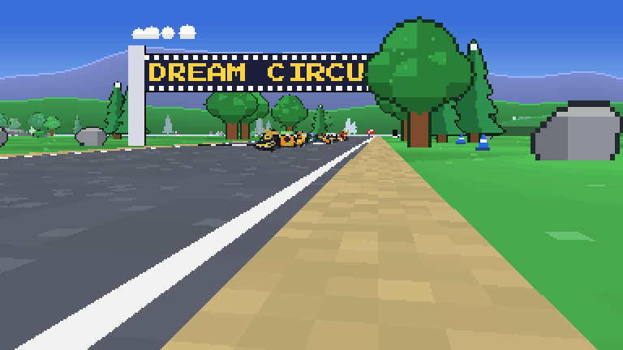</p>
<p align="center"><sub>Filmed in the game, on a figure-eight the designer built live: a jump ramp, a trick and its landing boost, then the bridge where the circuit crosses itself. The DATA page opens with the full 1080p film.</sub></p>

<p align="center"><sub><!-- designer-stats:start -->
5.1M-parameter circuit designer · 85%+ of live-built circuits drivable · 10.4 MB, runs on the CPU in a browser tab · 24 Heun steps per arc
<!-- designer-stats:end --></sub></p>

---

## What this is

1. **The game.** A third-person, Mode-7-style kart racer in a pixel framebuffer that takes the window's shape and fills the screen: up to 7 AI rivals, three speed classes, three worlds, a garage to build your kart, jump ramps with trick boosts, bridges where a figure-eight crosses itself, boost pads, nine items, drifting and mini-turbos, rocket starts, a full HUD, and a chiptune soundtrack. Keyboard, gamepad or touch (a joystick on phones). Everything runs in the browser with no server, and there are no image or sound files: the karts, scenery, music and sound are generated by code.
2. **The circuit designer.** A masked-conditional diffusion model (EDM, 1-D U-Net) trained on 66,500 circuits from a procedural circuit architect, 35% of them figure-eights. In the game it inpaints the road ahead of the karts, conditioned on everything already built and on how you are driving, and closes the loop at the start line. **No circuit exists before the race starts.**
3. **The Dream Lab** (DREAM LAB on the main menu, part of the DATA page). A second diffusion model, a *world model*, that imagines an entire racing simulator frame by frame from the keys you press, plus the science around it: a physics audit of the dream, linear probes that find what no single frame shows (yaw rate, slip, the curve of road beyond view), and steering vectors that edit its physics live.

<p align="center">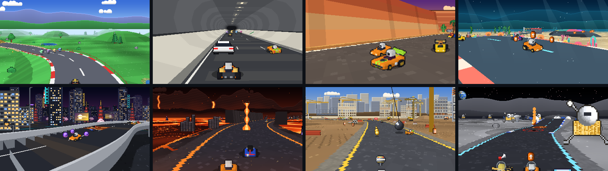</p>
<p align="center"><sub>Dream Valley, Neon Night and Sunset Mesa. Same HUD, same live designer.</sub></p>

## The game

| | |
|---|---|
| **Grand Prix** | 3 laps on a circuit dreamed for that race; re-race your last locked circuit from the setup screen |
| **Rivals** | 0 to 7 AI karts with racing lines, braking points, overtaking room, drifts into tight corners, items saved for the right moment, and the classic rubber band. Each drives a random garage build, and the harder the class, the better the build |
| **Difficulty** | Rookie, Pro and Legend: top speed, grip, how sharply the rivals drive and how good their karts are |
| **Garage** | Build your kart from 13 bodies inspired by real supercars (an Italian V8, a raging-bull V12 wedge, a British carbon-tub GT, a rear-engine flat-six, a W16 hypercar, a JDM twin-turbo, American muscle, a kei car, a rally hatch, a Le Mans prototype, an electric hypercar...), 13 wheels, 10 spoilers and 11 exhausts named after real tuner parts (GT wing, swan neck, ducktail, straight pipe, titanium tips, muffler delete...), plus 17 paints and 10 accents. Every part moves six stats, the ones classic kart racers show: speed, acceleration, weight, handling, traction and mini-turbo. The kart turns on a lit pedestal while you build it |
| **Driving** | Arcade handling with surfaces (asphalt, kerb, shoulder, grass), drifts that charge blue and orange mini-turbos, kart-to-kart bumps where the heavier kart gives less ground; your build's stats set top speed, acceleration, cornering, grip off the road and how hard a mini-turbo fires |
| **Jumps and tricks** | Ramps on the long straights: hop right at the lip for a trick, land it for a boost (a perfect trick boosts longer). Boost pads at corner exits |
| **Bridges** | When a figure-eight crosses itself, the later stretch flies 6 m over the earlier one on ramps, with guard rails and pillars; traffic passes over and under |
| **The start** | Hit the gas in the half second before GO for a rocket start; hold it too early and the wheels spin |
| **Layouts** | Surprise me, plain loop or figure-eight, chosen on the setup screen |
| **Items** | Rows of item boxes on the dreamed road and a roulette slot, and every kart shows what it carries, riding out behind it. **Turbo** and **Triple Turbo** boost; **Oil Slick** drops behind you; **Dream Orb** homes onto the kart ahead; **Boomerang** is thrown up the road and comes back, three times, spinning everyone it touches; **Bomb** is lobbed ahead and blows up when someone comes close; **Prism** makes you invincible and faster, spinning whoever you touch; **Shock** spins, shrinks and slows everyone else and knocks their items away; **Rocket** turns your kart into a rocket that flies itself up the road through the pack. Hold the button to keep oil, an orb or a bomb out behind you: it blocks one hit from behind. The odds depend on position: the leader mostly gets defensive items, the back of the pack the big ones, and dead last gets the rocket nine times in ten |
| **HUD** | Lap counter, race and best-lap timers, live position with podium colors, item slot with roulette (the item's name, shots left, and a meter while a prism or rocket lasts), standings for the whole field, speed and boost bar, minimap with the designer's guess, start lights |
| **Screen and controls** | The framebuffer is sized to the window at a whole-number scale (about 216 rows), so the game fills the screen with crisp pixels on any shape of display. On a phone, one thumb steers with a floating joystick (push it all the way over to drift, pull it back to brake; the gas is automatic) and the other has DRIFT and ITEM |
| **Rendering** | Mode-7 ground with mipmaps and distance fog, a software polygon rasterizer for bridges, ramps and pads (depth-sorted with the sprites), a parallax sky, billboarded scenery, karts assembled from their parts as voxel models and baked into 16 viewing angles, exhaust fire while boosting, speed lines and a wider view, and a shimmering "dream mist" at the edge of the road that does not exist yet |
| **Sound** | A four-channel chiptune per world (pulse lead and arpeggio, triangle bass, noise drums) that speeds up on the final lap and leads the mix, plus synthesized countdown, boost, jump, trick and item effects. The engine is a soft hum under the music (or off: ENGINE on the main menu) |

<p align="center">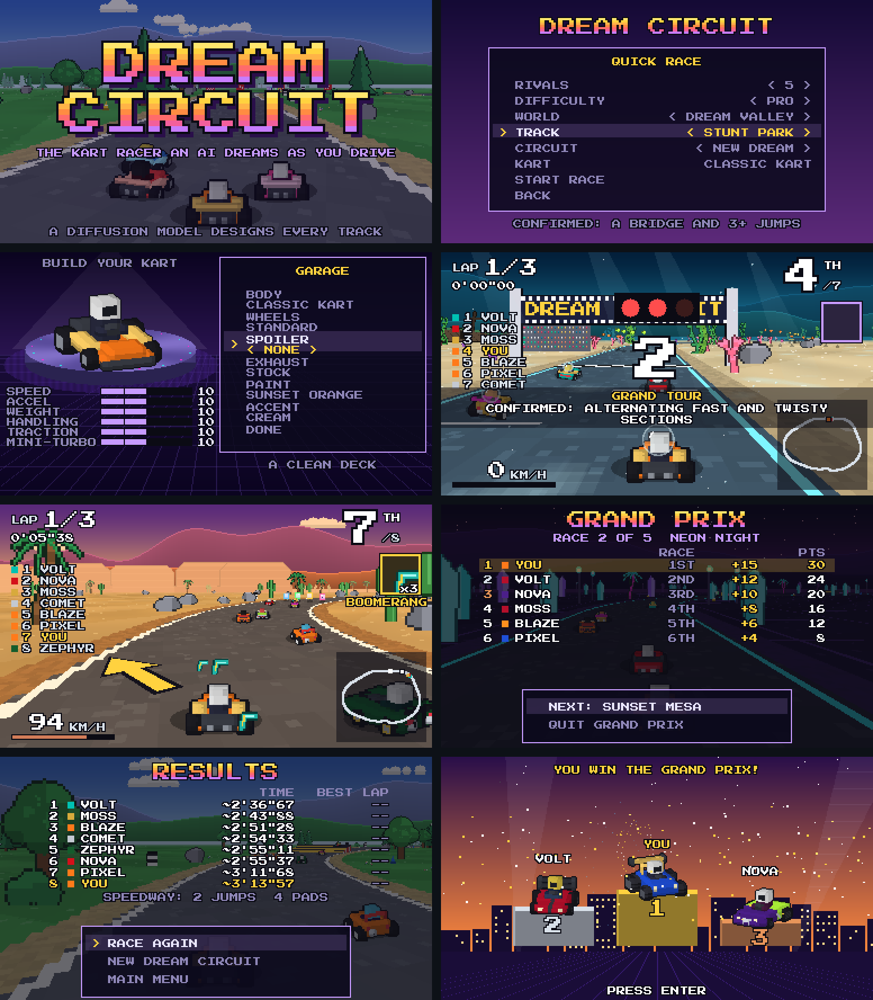</p>
<p align="center"><sub>Title, setup (the layout is a choice), lap 1 while an arc is being dreamed (the minimap shows the designer's guess for the rest of the figure-eight), and the results.</sub></p>

## The circuit designer

**Where the circuits come from.** A procedural *architect* (`trackgen/architect.py`) lays out kart circuits from real track elements: hairpins, tight corners, sweepers, kinks, chicanes, esses and double apexes, each easing in and out of its curvature like a clothoid, joined by straights whose lengths are solved so the lap closes exactly. A third of its circuits are figure-eights, two lobes through one steep crossing on straight road, which is what a bridge needs. Every circuit passes the rules the game enforces: lap length, a 9 m minimum corner radius, clearance between stretches that are far apart along the lap, a straight start line, and the size of the world. 70,000 of them, resampled to 256 evenly spaced points, are the training set.

**The model dreams steps, not points.** The network works on the 256 steps between consecutive road points (point *i* to point *i + 1*). Road that exists is given and stays exact; a new arc is the steps that continue it, added up from the last point that exists, so it starts exactly where the road ends. The lap closes because the dreamed run is corrected, evenly, to land on the start of the road. Why it is built this way is the story of how it got good, below.

**The model** is a 1-D U-Net with circular padding (the lap is periodic, so the road always meets itself), self-attention at the bottleneck, and EDM preconditioning (Karras et al., 2022). Its inputs are the noisy steps, a mask of the steps that are already road, those steps, and the position along the lap, so it knows where the start/finish straight is. Two optional conditions steer it: the *layout* (any, plain loop, figure-eight) and a *style* from 0 (calm) to 1 (wild), measured on the training circuits as how much, and how hard, a stretch corners. Training shows it random known stretches (the lap so far from the grid, as in the game; a random stretch; or nothing at all), so one model dreams whole circuits, extends the road and closes the loop.

**Live, in the game:**

1. Before the countdown it dreams the start grid and the first stretch: a quarter of the lap.
2. During lap 1, whenever the leader gets within 28% of a lap of the end of the road, it dreams the next 32 points (about 130 m), conditioned on everything already built, the layout you picked and the style your driving asks for. Each arc is 24 Heun steps (47 network calls) in a Web Worker.
3. Each new arc is lightly smoothed and checked in context, together with the designer's guess at the rest of the lap, against the architect's rules. A failing arc is dreamed again, up to 3 times. Road that exists never moves.
4. Where the road crosses itself, the later stretch becomes a bridge, lifting road that was already built if it has to.
5. The last arc closes the gap to the grid. The circuit **locks**, the minimap turns solid, and laps 2 and 3 run on exactly the road that was dreamed.

**How your driving shapes the track.** Over the last eight seconds the race tracks your speed (as a share of your class's top speed), how much of the time you drift, how much you spend off the road and whether you spin or bump. Before each arc it turns those into the style the designer is asked for: fast, sideways and clean asks for a wilder, more technical arc; off the road and bumping asks for a calmer one; Legend leans wild and Rookie calm. The HUD shows the style each arc was dreamed with.

<picture>
  <source media="(prefers-color-scheme: dark)" srcset="docs/assets/trackgen_style_dark.png">
  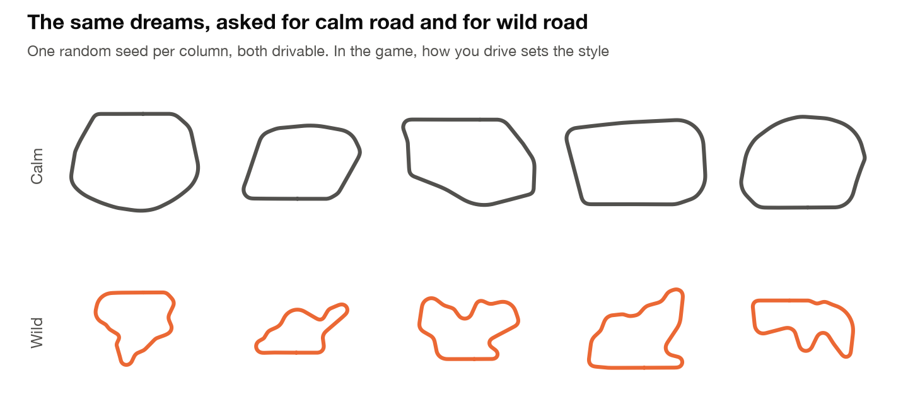
</picture>

<picture>
  <source media="(prefers-color-scheme: dark)" srcset="docs/assets/trackgen_growth_dark.png">
  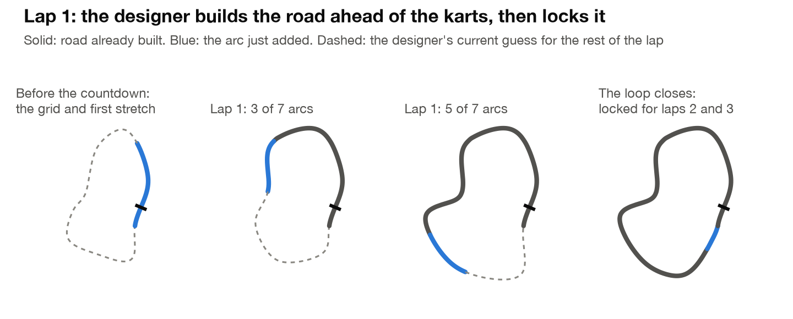
</picture>

**Does it consistently build proper tracks?** Measured with `dreamcircuit eval-tracks`. "Drivable" means every one of the architect's rules holds on the reconstructed centerline:

<!-- trackgen:start -->
| What was measured | Loops | Figure-eights |
|---|---|---|
| Built live, arc by arc, the way lap 1 builds them (n = 200 each) | **97.0%** | **85.5%** |
| Arcs dreamed again after failing a rule, per live circuit | 1.68 | 5.07 |
| Whole circuits dreamed in one pass from nothing (n = 1,000 each) | 71.8% | 48.7% |
| Why one-pass circuits failed | 73 too big, 67 crossings, 64 too tight, 38 too close to itself, 23 length, 17 start not on a straight | 156 bent crossing, 141 too big, 98 too tight, 55 start not on a straight, 42 crossings, 14 shallow crossing, 5 crossing at the start, 1 length, 1 too close to itself |
| Style steering: technicality measured on arcs asked for calm (0.1) vs wild (0.9) | 0.31 vs 0.83 | |
<!-- trackgen:end -->

<picture>
  <source media="(prefers-color-scheme: dark)" srcset="docs/assets/trackgen_gallery_dark.png">
  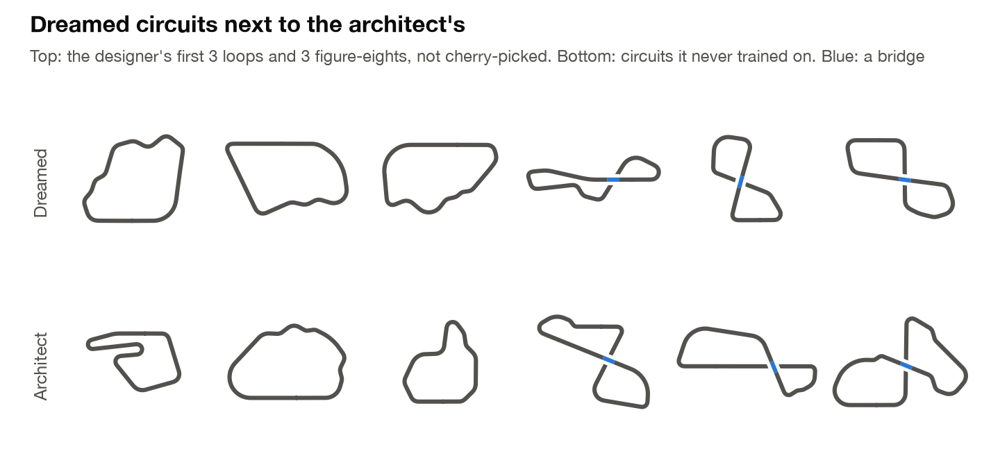
</picture>

**Getting there.** The first version of this designer dreamed the points themselves, (x, y) in meters, and it could not build a circuit live at all: 0 of 16 laps. Every join between new and existing road had a kink. Measuring it showed why. Given the road so far, the network placed the first new point 2.6 m off on average at a noise level of 30 m, and 5 to 7 m off at 100 to 300 m. With points 2.8 m apart that is a kink: measured joins turned by up to 120 degrees at one point, where the road normally turns by about one. And it is decided early in sampling, while the noise is high. Later steps, which see only small noise, treat a smooth offset as road and keep it. Absolute coordinates span hundreds of meters, and a join needs them right to a fraction of a percent. Three changes fixed it:

- **Steps instead of points.** A step is a few meters long. Continuing the road only asks the network to keep a step close to its neighbor, and the position at the join is exact by construction.
- **Known road is exact, in training as in sampling.** The first version noised the known road like everything else and learned it with a tenth of the loss weight. Now known road is never noised, the network returns it unchanged, and only the road to be dreamed is learned. The loss is weighted up next to the join.
- **Train where the corners are decided.** The default EDM noise schedule spends almost no training on the small noise levels where a corner's last fraction of a meter is set. Most failures of the first version were single corners a little tighter than the 9 m minimum, so the training noise was spread down to those levels.

## The Dream Lab: a world model you can drive

The DATA page holds the project this game grew out of: **a racing simulator that does not exist.** Every frame is imagined by a diffusion model, live in the browser, from the last four frames and the keys you press.

<p align="center">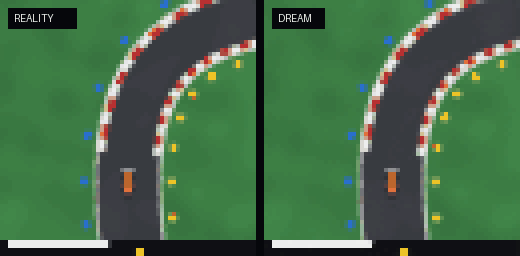</p>
<p align="center"><sub>One pixel-only autopilot, two worlds. Left: a physics simulator. Right: the neural network's dream, which the autopilot drives from the network's own imagined frames. No game code runs on the right.</sub></p>

<p align="center"><sub><!-- stats:start -->
9.7M parameters · 1.84 GMACs per denoising step · 60,000 training steps · 19.6 MB in the browser · 463,680 training frames from 360 circuits
<!-- stats:end --></sub></p>

1. **The world.** A physically grounded simulator of a Formula Student-class electric race car: dynamic bicycle model, Pacejka-style tyres with a friction ellipse, an 80 kW power cap, traction control and ABS, on procedurally generated circuits marked with Formula Student cones (blue left, yellow right). It is also where the circuit designer's training circuits come from.
2. **The dream.** An EDM diffusion U-Net (the DIAMOND / GameNGen recipe) trained from scratch on 464k frames to predict the next frame from the last four frames and the controls. Exported to ONNX and run at 15 fps on WebGPU.
3. **The audit.** The question video-model benchmarks keep asking (PhyWorldBench, WorldBench, PhysicalRealismBench), asked of a model that can be checked exactly: *does the dream obey physics?* An instrument built on differentiable image registration reads dreamed frames back into speed and yaw rate and compares them with the simulator.
4. **The mind.** Linear probes find quantities the network was never told about (yaw rate, slip, curvature of road it cannot see yet), and steering vectors edit the dream's physics live: push one direction and the world rushes by without the throttle being touched.

Everything below is measured on 40 circuits the model never saw during training. The numbers are generated from `results/summary.json` by `scripts/update_readme.py`; none are typed by hand.

<!-- results:start -->
| What was measured (held-out circuits) | Dream | Reference |
|---|---|---|
| Next-frame PSNR | **41.9 dB** | 23.6 dB copying the last frame |
| PSNR after 1 s / 4 s of dreaming | **26.5 / 17.7 dB** | 17.7 / 16.5 dB |
| Speed error vs. the real car, first second | **0.15 m/s** | speeds of 6-29 m/s |
| Dreamed speedometer vs. dreamed motion | **0.35 m/s** | 0.20 m/s instrument floor on real frames |
| Moments exceeding tyre grip (friction circle) | **4.0%** | 2.4% on real frames |
| Counterfactual steering turns the right way | **100%** | yaw-rate correlation 1.00, response ratio 1.03 |
| Throttle vs. brake changes speed the right way | **100%** | response ratio 1.00 |
<!-- results:end -->

<picture>
  <source media="(prefers-color-scheme: dark)" srcset="docs/assets/fidelity_dark.png">
  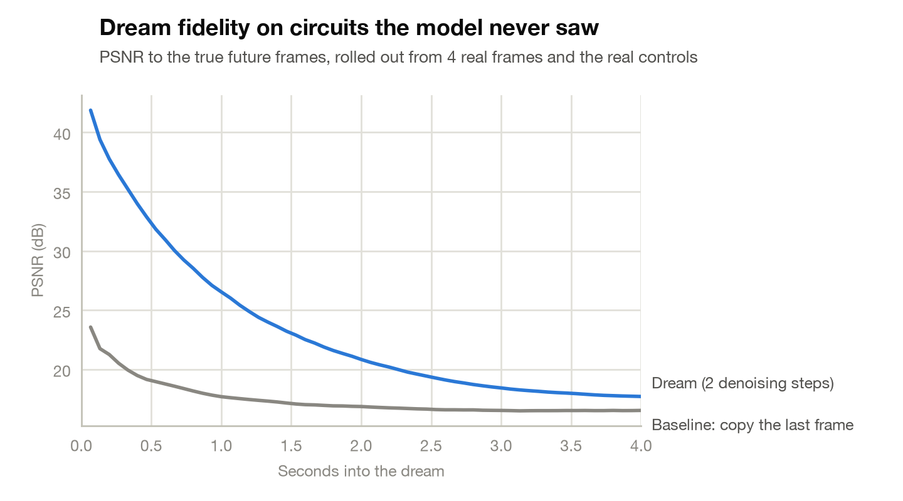
</picture>

**The dream responds to controls it was never explicitly taught.** From one set of starting frames, five different control sequences produce five different futures:

<p align="center">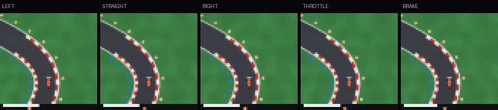</p>

<picture>
  <source media="(prefers-color-scheme: dark)" srcset="docs/assets/controllability_dark.png">
  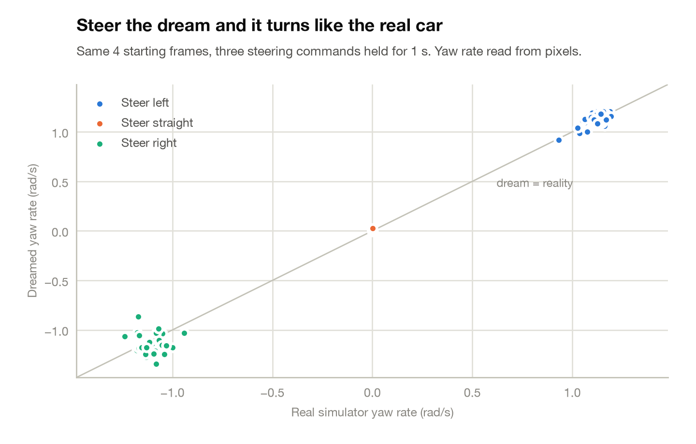
</picture>

### Inside the network

<!-- probes:start -->
| Linear probe on the bottleneck (held-out R²) | Trained | Raw pixels | Random weights |
|---|---|---|---|
| Yaw rate | **0.94** | 0.48 | 0.26 |
| Lateral slip | **0.77** | 0.10 | 0.01 |
| Curvature 10 m ahead | **0.84** | 0.72 | 0.33 |
| Curvature 30 m ahead (beyond view) | **0.55** | 0.25 | 0.03 |
| Heading vs. track | **0.47** | 0.07 | 0.01 |
<!-- probes:end -->

Speed and the steering angle are left out of that table on purpose: both are drawn in the frame's HUD, so even raw pixels decode them (R² 0.99 for each). Yaw rate exists in no single frame, and the curvature 30 m ahead lies beyond the top edge of the view; the network represents both.

<picture>
  <source media="(prefers-color-scheme: dark)" srcset="docs/assets/probes_dark.png">
  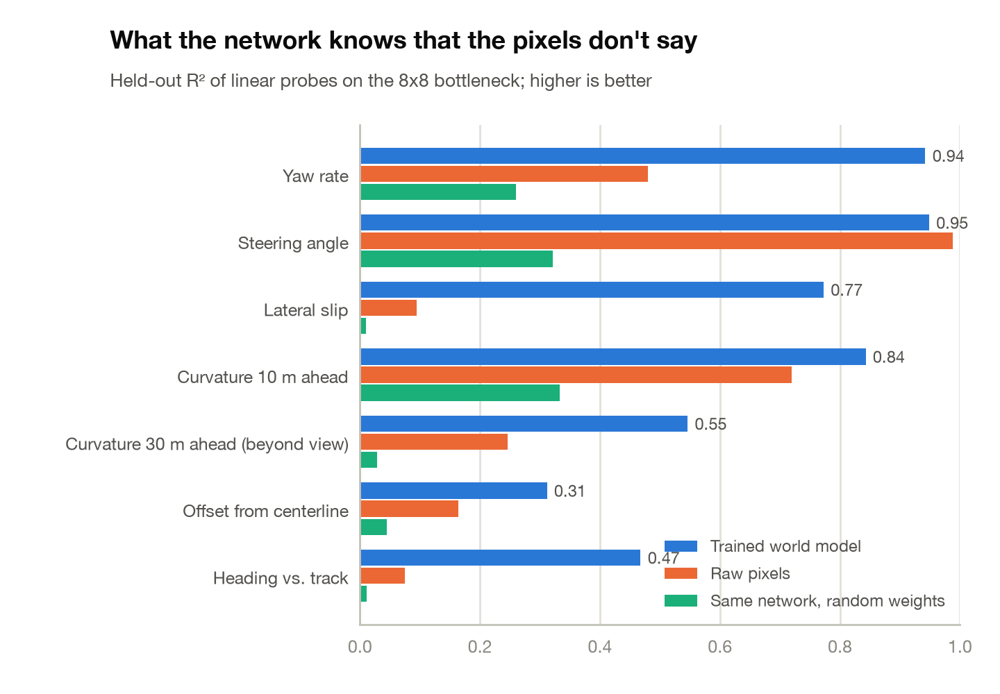
</picture>

**Decodable is not the same as used.** A ridge probe's direction can decode a quantity and still be ignored by the network: pushed along it, the dream barely changes. The difference-of-means ("mass-mean") direction, pushed equally hard, rewrites the dream's physics, mirroring what Marks & Tegmark found for truth directions in language models:

<!-- steering:start -->
Pushing the bottleneck along the mass-mean *speed* direction moves the dreamed speed from **2.8 m/s** (alpha = -2) to **25.1 m/s** (alpha = 2) with the controls held neutral. The ridge-probe direction, pushed equally hard, moves it from 11.3 to 14.9 m/s.
<!-- steering:end -->

<picture>
  <source media="(prefers-color-scheme: dark)" srcset="docs/assets/steering_dark.png">
  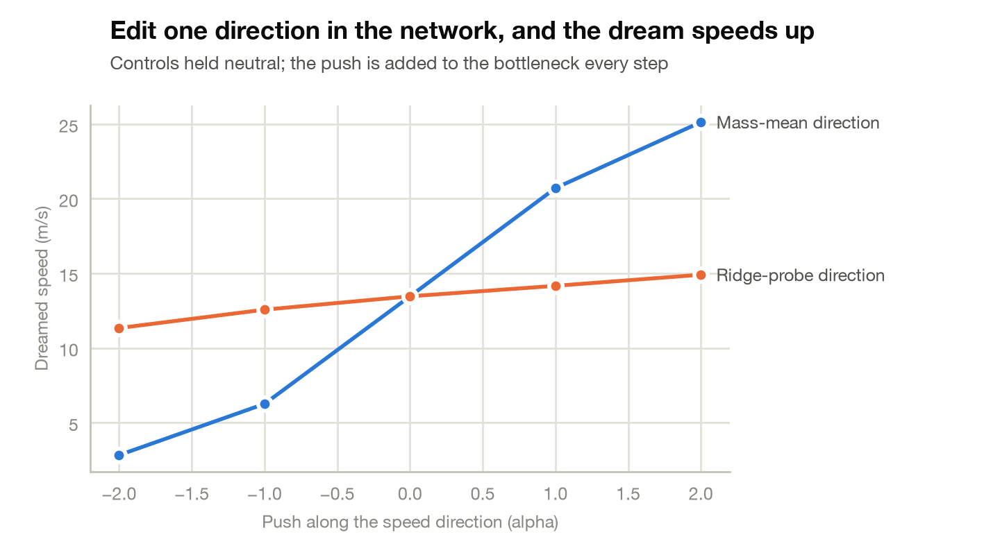
</picture>

### The autopilot

A 0.66M-parameter CNN, distilled from a privileged expert that sees the true track geometry ("learning by cheating"), drives from four frames of pixels. Because it only ever sees pixels, it can drive inside the dream, which is what the animation at the top of this section shows.

<!-- policy:start -->
From pixels alone the autopilot laps held-out circuits at **2.03 laps/min** (96% of its privileged teacher's 2.11), off the asphalt 3.9% of the time. One round of DAgger cut that from 5.3%.
<!-- policy:end -->

## How it works

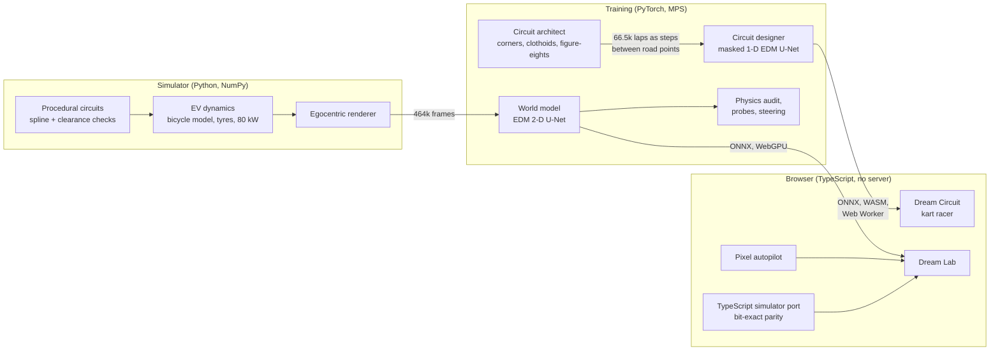

**Off the main thread.** The circuit designer runs on ONNX Runtime Web's WASM backend in a Web Worker, so dreaming an arc (24 Heun steps, 47 network calls) never stalls the race; the worker posts its running whole-lap guess a few times along the way for the minimap. The race code adds a safety net for slow devices: no kart can drive past road that has not been dreamed yet, because speed is capped by the distance left to the frontier.

**The world model in the browser.** The denoiser is exported with its EDM preconditioning built in, so the page runs only a 4-line Euler loop around it. GroupNorm is rewritten as one fused InstanceNormalization per layer (on WebGPU, per-kernel dispatch overhead, not FLOPs, dominates small models). Weights are stored as fp16 and cast to fp32 in the graph: half the download, and it runs on every GPU.

<p align="center">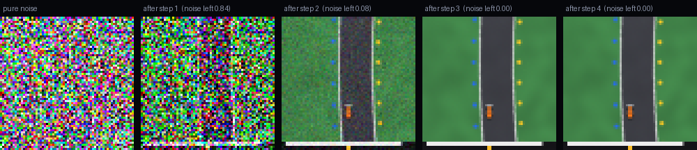</p>
<p align="center"><sub>One frame being imagined: from pure noise to a frame in a few Euler steps of the EDM sampler. The DATA page shows this live.</sub></p>

**The audit instrument.** For an egocentric top-down camera, consecutive frames differ by a rigid motion of the car. A joint grid search over forward motion and rotation, refined by Adam through `grid_sample`, recovers that motion from pixels. On real frames it agrees with the simulator's ground truth to R² = 0.999 for both speed and yaw rate near the track. Run on dreamed frames, it measures the dream's physics.

## Engineering highlights

- **Found a bug in ONNX Runtime Web.** Its WebGPU convolution returns wrong results when the input-channel count is divisible by 3 but not by 4 (6, 9, 15 and 30 are wrong; 12 and 16 are right). Located with a per-node WebGPU-vs-WASM diff tool over 471 intermediate tensors (`web/tools/`), characterized with a channel sweep, and worked around by zero-padding the first convolution from 15 to 16 input channels, which is exact.
- **And a sharp edge in it.** The lab's two inference sessions share one WASM module, and a `run()` started while another was still in flight corrupted it (`RuntimeError: memory access out of bounds`), after which every run on the page failed. Switching lab modes mid-clip was enough to trigger it. Every inference now goes through one page-wide queue (`web/src/ort-queue.ts`, with tests).
- **Bit-exact cross-language simulator.** The TypeScript port of the physics and renderer reproduces Python's trajectories to machine precision (about 1e-15), and **0 of 258,048 pixel bytes differ**. To get there, the port emulates NumPy's float32 rounding and its summation order. CI checks it against golden trajectories on every push.
- **Diagnosed, not tuned.** The first figure-eight designer built 0 of 16 laps live. Instead of training longer, it was measured: given the road so far, the network misplaced the first new point by meters at high noise, which became a kink at every join. The fix was a change of representation (steps between points) plus exact known road, not more compute. The full trail, including the four fixes that did not work, is in the [design notes](docs/DESIGN.md#what-did-not-work-and-what-did).
- **Game logic under test, headlessly.** Live track growth (committed road never moves, the loop closes and locks), bridges (built where a figure-eight crosses itself, lifting road that already exists; karts stay on the deck), jumps and tricks (a hop at the lip pays a boost on landing), the start procedure, lap counting (including backing over the line), the inference queue, items (odds including the last-place rocket, pickups, oil, homing orbs, boomerangs that come back, bombs, prisms, shocks, rockets that fly themselves, items held out as a shield, and press-not-hold firing in a full 8-kart race), the garage (stats within range, better rival karts in harder classes, a fast build really is faster and a heavy one wins the bump), the screen sizing and the touch joystick, and AI rivals that must lap a twisty circuit off the grass and drift its corners. A crowded-race test caught kart bumps pumping speed in pile-ups: the impulse was not projected onto each kart's heading, and one kart reached 88 m/s. Filming the hero video caught another: the countdown never passed the throttle to the race, so a rocket start was impossible. The race was also driven end to end in a browser through a dev-only hook.
- **A film crew in the dev build.** The DATA page's hero video is shot in the game itself (`web/src/tools/cinema.ts`): scripted cameras (a drone over the grid, the chase camera through a jump, an orbit around the bridge, a tracking shot, a crane) film a race on a circuit the designer dreamed, cross-fade the shots into a seamless loop, upscale the pixel art 5x without smoothing, and encode 1080p H.264 in the browser with WebCodecs and a hand-written MP4 muxer (`web/src/tools/mp4.ts`).
- **123 tests** in all: 61 in pytest, including Hypothesis property tests that fuzz the vehicle dynamics, and 62 in Vitest. `ruff`, `mypy` and `tsc` are clean, and CI runs everything on GitHub Actions with CPU-only PyTorch.
- **Data at simulator speed.** 464k frames from 360 circuits in 100 s on 10 cores, written straight into shared memmaps. The architect's 70,000 circuits take 13.5 minutes.
- **Reproducible end to end.** `make all` regenerates every model, number and chart in this README; the numbers are written in by `scripts/update_readme.py`. (The gameplay captures come from the game itself.)

## Quickstart

Requires Python 3.11+, [uv](https://github.com/astral-sh/uv) and Node 22+. Training used an Apple M4 Pro (MPS); CUDA and CPU work too.

```bash
make setup      # venv + dependencies + web app
make tracks     # circuit designer: 70k circuits, training, validity at scale, figures (~2 h)
make data       # world model data: 464k training frames, 39k test frames (~2 min on 10 cores)
make train      # the world model (~3.5 h on an M4 Pro, resumable)
make policy     # the pixel autopilot (~15 min)
make export     # ONNX models + simulator assets for the browser
make report     # physics audit, probes, steering, figures, web summary, README numbers
make web-dev    # http://localhost:5173 (the game); the Dream Lab is at /data.html
```

`make test` runs both test suites. `make lint` runs ruff, mypy and tsc.

## Repository map

```
src/dreamcircuit/
  trackgen/   circuit designer: the architect (corners, figure-eights), steps representation,
              masked 1-D EDM model, live generation, eval, figures
  sim/        track generation, vehicle dynamics, renderer, vectorized env, scripted drivers
  data/       parallel dataset generation, memmapped window sampling
  model/      world-model U-Net, EDM wrapper + sampler, pixel policy
  train/      world model and autopilot training loops
  eval/       registration instrument, physics audit, probes + steering, report
  export/     ONNX export with WebGPU-safe transforms, web assets + parity fixtures
web/
  index.html  the game          src/game/   renderer, race, AI, HUD, menus, live circuit designer
  data.html   the Dream Lab     src/        world-model engine, simulator port, lab UI, charts
tests/        pytest suites (physics invariants, models, instruments, data, circuit designer)
configs/      training configurations (TOML)
results/      evaluation output that the README and website render
docs/         design notes, model cards, figures
```

## Honest limitations

- **One crossing at most.** Laps are plain loops or figure-eights with a single bridge; there are no multi-level interchanges, and the only elevation is bridges and jump ramps.
- **"Drivable" is geometric.** Validity means the architect's rules hold: corner radius, clearance, lap size, a straight start, a steep crossing on straight road. It says nothing about whether a circuit is *fun*, and the designer has never seen a race.
- **The style signal is a heuristic.** How you drive is summarized by a hand-written formula (speed, drifting, time off the road, spins) that asks the designer for a calmer or wilder arc; it is not learned from players.
- **The game's handling is arcade.** Karts use simple arcade physics tuned for feel. The EV simulator with tyres and a power cap lives in the Dream Lab, where the physics matters.
- **The world model is small.** It sees a 64x64 top-down view of a simple scene. The method scales; this compute budget does not. It has no long-term memory either: turn around and it re-imagines the road behind you.
- **The physics audit compares against a simulator, not a real car.** It tests whether the network learned *these* laws of motion, which is exactly what makes it checkable.

## References

- Karras et al., *Elucidating the Design Space of Diffusion-Based Generative Models* (EDM), NeurIPS 2022.
- Lugmayr et al., *RePaint: Inpainting using Denoising Diffusion Probabilistic Models*, CVPR 2022.
- Alonso et al., *Diffusion for World Modeling: Visual Details Matter in Atari* (DIAMOND), NeurIPS 2024.
- Valevski et al., *Diffusion Models Are Real-Time Game Engines* (GameNGen), 2024.
- Ha & Schmidhuber, *World Models*, 2018.
- Chen et al., *Learning by Cheating*, CoRL 2019; Ross et al., *DAgger*, AISTATS 2011.
- Li et al., *Emergent World Representations* (Othello-GPT), ICLR 2023; Marks & Tegmark, *The Geometry of Truth*, 2023.
- *What Do World Models Learn in RL? Probing IRIS and DIAMOND*, 2026.
- Pacejka, *Tire and Vehicle Dynamics*; Rajamani, *Vehicle Dynamics and Control*.

## License

MIT. See [LICENSE](LICENSE). The game's pixel font is Press Start 2P by CodeMan38, under the SIL Open Font License 1.1 (via `@fontsource/press-start-2p`). All other art and sound are generated by the code in this repository.
